# tutorial-openGL-Code-Blocks
Esse é um tutorial básico para configurar OpenGL no Code::Blocks no distro Debian 10

_by **Abdul Kevin Alexis**_

Vamos usar o terminal para fazer os comandos. É preciso reconfigurar o Code::Blocks. Seria melhor desinstalar para podermos instalar novamente.

* __Passo 1__ Faça um "sudo apt-get update" para manter sua lista de pacotes atualizada.
~~~bash
sudo apt-get update
~~~
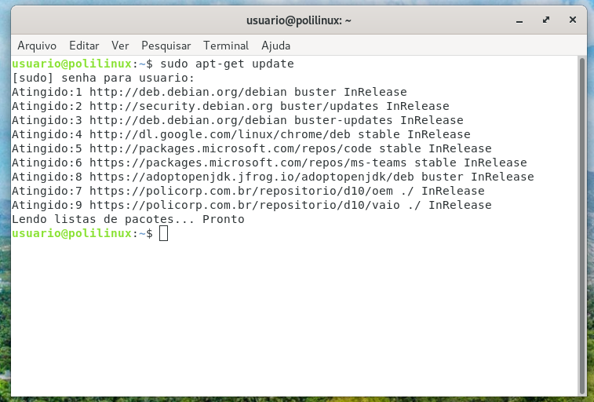

* __Passo 2__  Faça "sudo apt-get install codeblocks" para instalar o codeblock
~~~bash
sudo apt-get install codeblocks
~~~
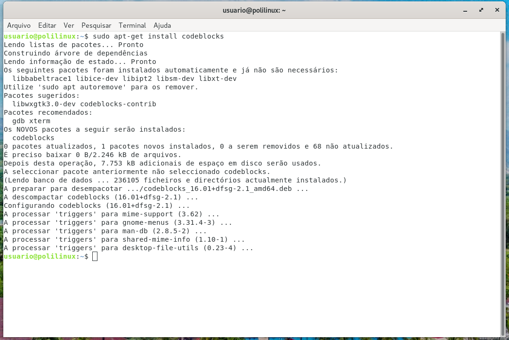

* __Passo 3__  Faça "sudo apt-get install libc6-dbg gdb valgrind" para instalar o compilador _**GDB**_
~~~bash
sudo apt-get install libc6-dbg gdb valgrind 
~~~
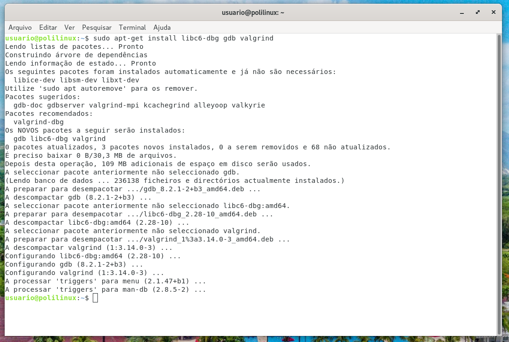

* __Passo 4__ Vamos instalar a biblioteca _**FreeGlut**_
~~~bash
sudo apt-get install freeglut3 freeglut3-dev
~~~
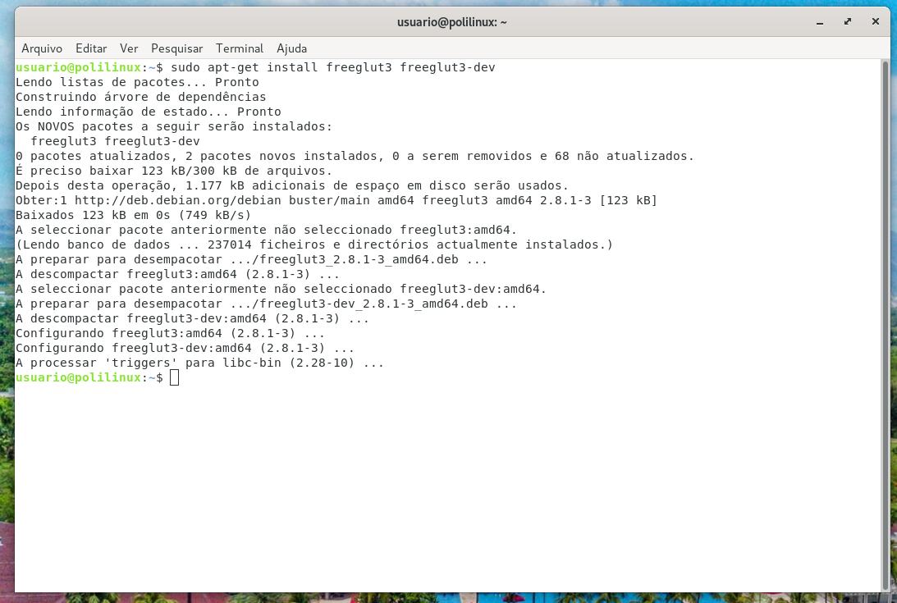

* __Passo 5__ Vamos instalar a biblioteca _**Glew**_
~~~bash
sudo apt-get install libglew-dev
~~~
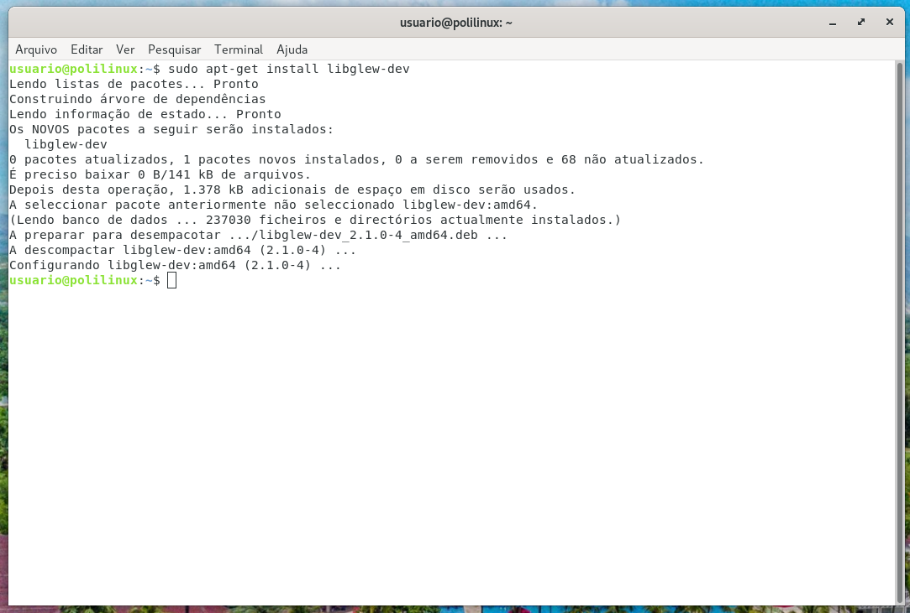

* __Passo 6__ Vamos abrir o Code::Blocks, criar um projeto OpenGL e clicar em _"GO"_

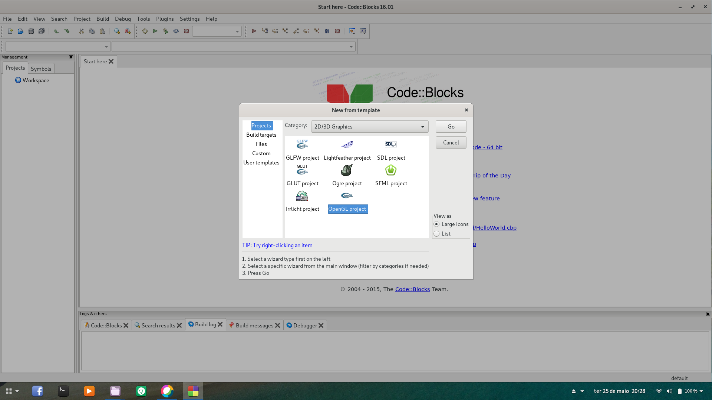

* __Passo 7__ Vamos nomear o projeto e clicar em _"Next"_

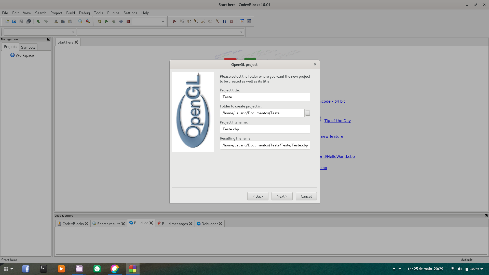

* __Passo 8__ Quando criar o projeto, vai ser criado automaticamente um arquivo _"main.c"_ para fazer teste

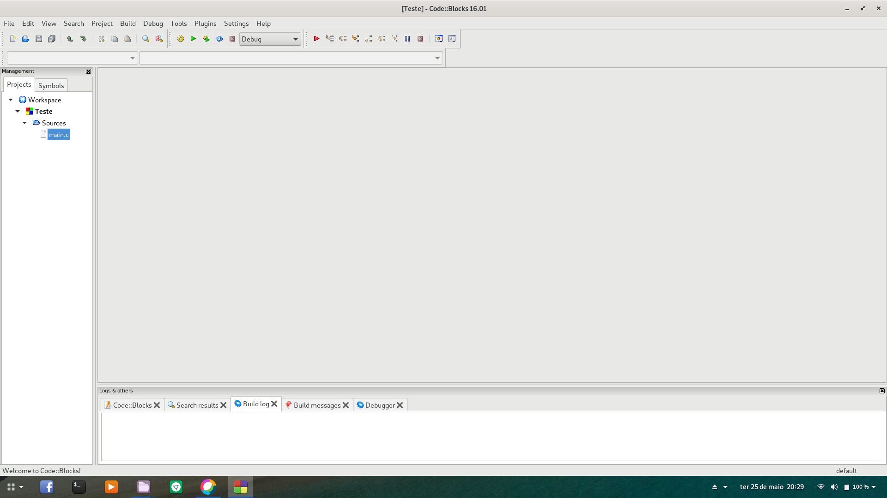

* __Passo 9__ Antes de finalizar , deve ser configurado o Debbuger. Vai na barra superior Project -->Build Optio --> Debug --> Linker setting e vamos adicionar as bibliotecas que instalamos. Da seguinte forma, add _"GLU"_ e em seguida _"glut"_ (as duas como igual que eu escrevi). 

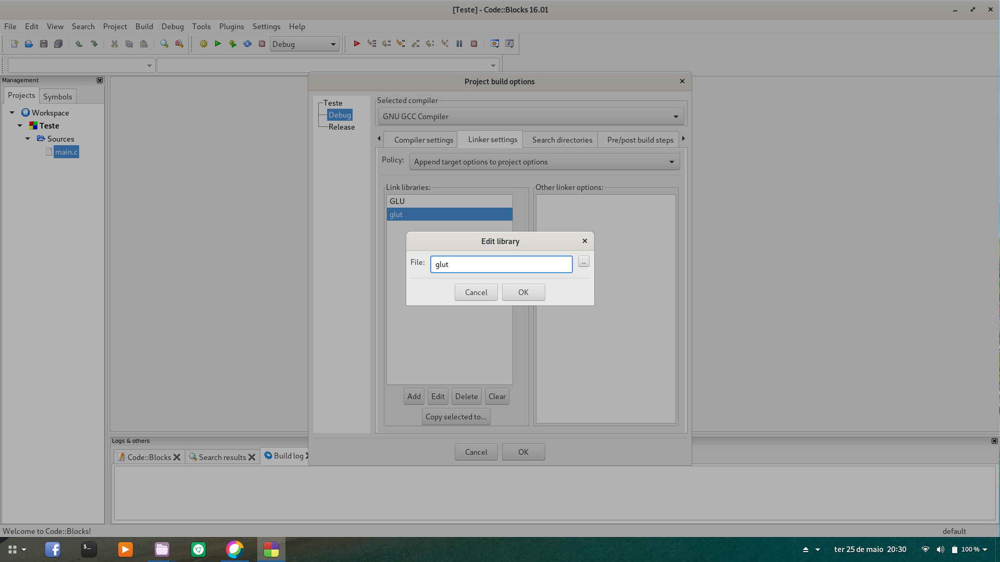

* __Passo 10__ Agora é só rodar. E "Voilà!"

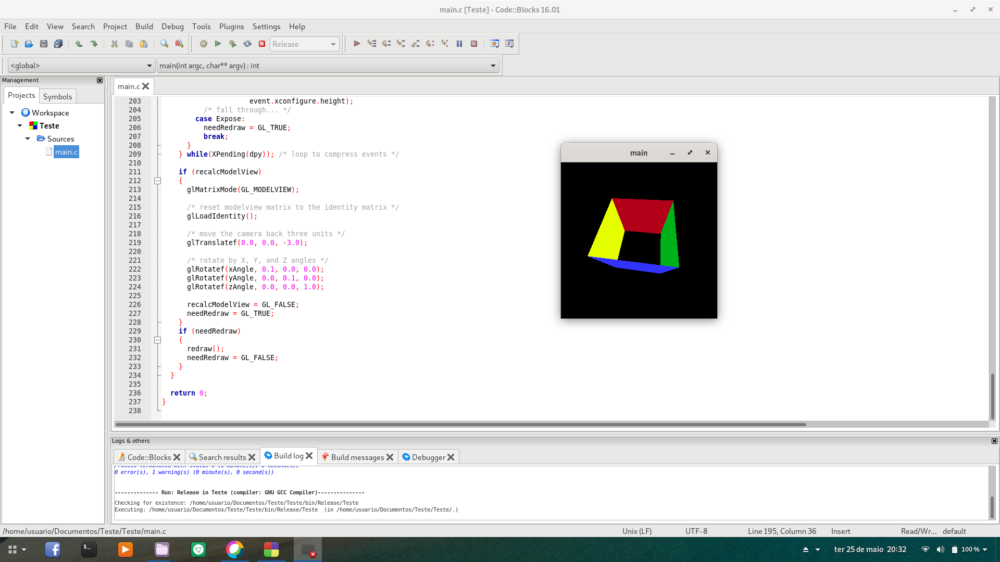

#[Opcional]
* __Passo 11__ Adicione a biblioteca _**SOIL**_
~~~bash
sudo apt-get install libsoil-dev
~~~

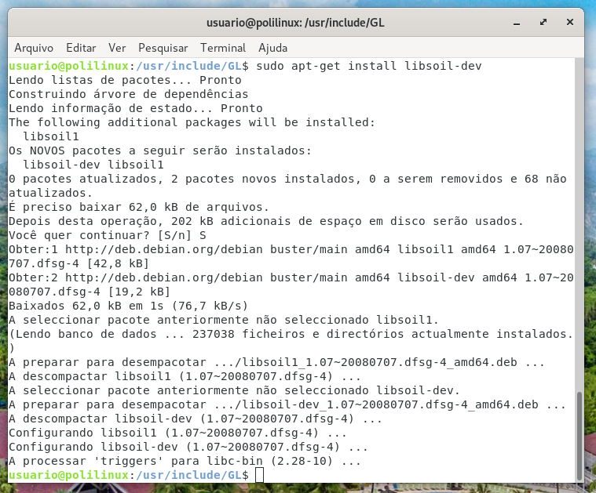

* __Passo 12__ Configure Project -->Build Optio --> Debug --> Linker setting e adicione isso no campo **Other linker options:**"-lSOIL -lglut -lGLU -lGLEW -lGL -lm" (sem as aspas).

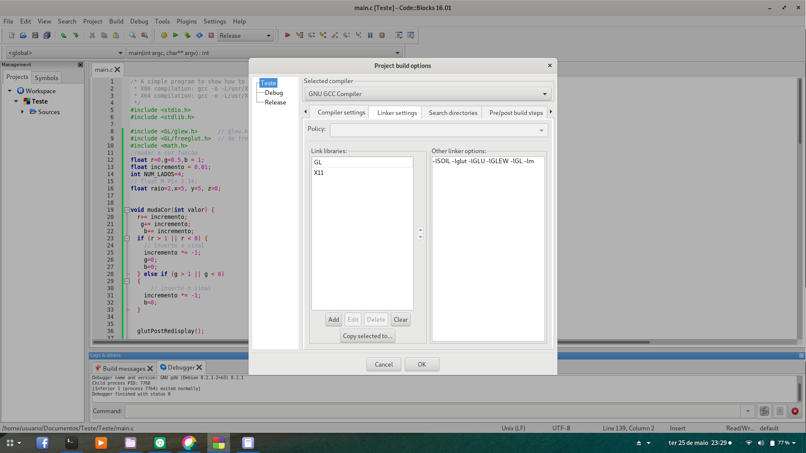

